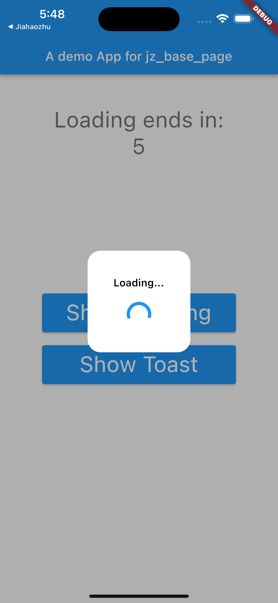
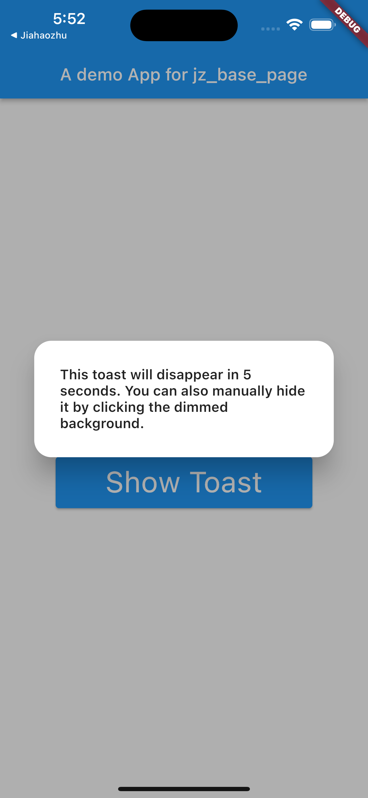

A package that implements a base page that can support some common actions such as loading and toast.

<left></left>

## Features

Adding this package to your App to implement pages that can:

- Show and hide loading toast with a single function call.
- Show and hide message toast with a single function call.

## Getting started

### Add dependency

In terminal, go to the project's root directory and run the following command:

```shell
 $ flutter pub add jz_base_page
```

This will add a line like this to your package's pubspec.yaml (and run an implicit `flutter pub get`):

```yaml
dependencies:
  jz_base_page: ^1.0.0
```

Alternatively, your editor might support `flutter pub get`. Check the docs for your editor to learn more.

### Import it

Now in your Dart code, you can use:

```dart
import 'package:jz_base_page/jz_base_page.dart';
```

## Usage

After importing the package, for any page you want to support the functions, instead of extending from `StatefulWidget`, you need to extend your page from `JZBasePage` like following:

```dart
class Page extends JZBasePage {
  const Page({Key? key}) : super(key: key);

  @override
  JZBasePageState<JZBasePage> createState() {
    // TODO: implement createState
    throw UnimplementedError();
  }
}
```

Please Keep in mind that instead of `State<StatefulWidget>`, the return type of the function `createState` is now `JZBasePageState<JZBasePage>`. Therefore, a state extends from `JZBasePageState` should be implemented as following:

```dart
class PageState extends JZBasePageState<Page> {
  @override
  Widget contentBuilder(BuildContext context) {
    // TODO: implement contentBuilder
    throw UnimplementedError();
  }
}
```

Different from the `build` function of a normal state extended from `State`, the state extends from `JZBasePageState` requires a implementation of the `contentBuilder` function, which, as it function name says, is a builder for the content of the page.

For more detail, check the example App in the `/example` folder.

## Additional information

For anything you want to talk about, feel free to send an email to [me](jiahao_zhu98@qq.com). But since I'm currently having a pretty heavy workload, the response time is not guaranteed, sorry for that.
